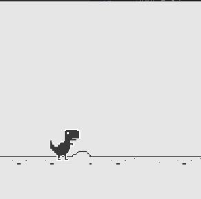

# Estudo de Java
Este repositório tem como objetivo o estudo da linguagem Java por meio do desenvolvimento de jogos. Ao longo dos projetos, são explorados conceitos fundamentais da linguagem, além de desafios práticos aplicados em jogos simples e populares.

 

*Como funciona esse repositório:*
 
 
Este repositório serve como um espaço para armazenar o código-fonte de diversos projetos. Cada projeto tem como foco o aprimoramento da lógica de programação e desafia o desenvolvedor a aplicar conceitos da linguagem Java em cenários de desenvolvimento prático.

 

*Observações:*

- Projetos desenvolvidos exclusivamente para estudo.

# Projetos

<table>
  <tr>
    <td></td>
    <td>
      <h2 style="margin-top: 0; font-size: 24px; color: #333;">Dino Chrome</h2>
      <h3 style="font-size: 18px; color: #666;">Jogo offline incorporado no navegador Chrome</h3>
      
O jogador deve evitar obstáculos enquanto o dinossauro corre por um cenário desértico.

      
Status: Em progresso

      <a href="DinoChrome" style="color: rgb(120, 120, 255); text-decoration: none;">Ver código</a>
    </td>
  </tr>

</table>
